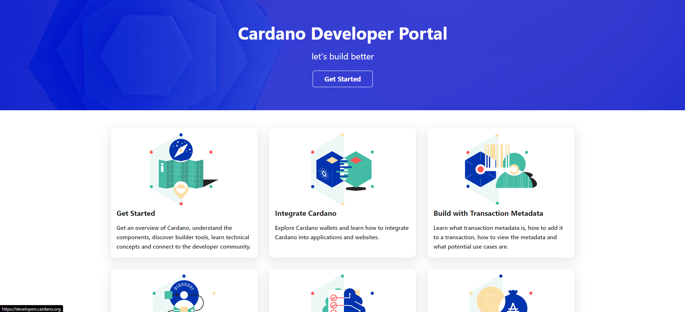

<h2 align="center"> Cardano Development </h2>

   </a>
    
  </a>
  
  
    
  </a>
  
  </a>
    
  </a>
  
  </a>
    
  </a>
  
   </a>
    

  
<table align="center">
  <tr>
    <td align="center" style="padding=0;width=50%;">
      
      <h4> let's build better </h4>
    </td>
  </tr>
</table>

## What is Cardano?

Cardano is a collection of open-source, patent-free protocols. It's a platform that enables you to store, transform, and manage value, identity, and governance. Cardano follows research not opinions or bias.

## How did it start?

Cardano started as a significant research and development project in 2015, and it took almost two years of research to get to a position to start writing code.

## Cardano Components

<ul>
  <li><a href="https://github.com/input-output-hk/cardano-node#cardano-node-overview" target="_blank" rel="noopener noreferrer"><code>cardano-node</code></a> is the core component that is used to participate in a Cardano decentralised blockchain. </li>
  <li><code>cardano-cli</code> is the Cardano Command Line Interface (CLI). For some time this component is included in <a href="https://github.com/input-output-hk/cardano-node#cardano-node-overview" target="_blank" rel="noopener noreferrer"><code>cardano-node</code></a>.</li>
  <li><a href="https://github.com/input-output-hk/cardano-wallet#overview" target="_blank" rel="noopener noreferrer"><code>cardano-wallet</code></a> is the HTTP server and command-line for managing UTxOs and HD wallets in Cardano.</li>
  <li><a href="https://github.com/input-output-hk/cardano-db-sync#cardano-db-sync" target="_blank" rel="noopener noreferrer"><code>cardano-db-sync</code></a> is the component that follows the Cardano chain and stores blocks and transactions in PostgreSQL.</li>
  <li><a href="https://github.com/input-output-hk/cardano-graphql#overview" target="_blank" rel="noopener noreferrer"><code>cardano-graphql</code></a> is a cross-platform, typed, and queryable API for Cardano.</li>
  <li><a href="https://github.com/input-output-hk/cardano-rosetta#cardano-rosetta" target="_blank" rel="noopener noreferrer"><code>cardano-rosetta</code></a> is an implementation of the open standard <a href="https://www.rosetta-api.org/" target="_blank" rel="noopener noreferrer">Rosetta</a> for Cardano.</li>
  <li><a href="https://github.com/input-output-hk/cardano-addresses#overview" target="_blank" rel="noopener noreferrer"><code>cardano-addresses</code></a> is a module that provides mnemonic (backup phrase) creation, and conversion of a mnemonic to seed for wallet restoration, and address derivation functionalities.</li>
  <li><a href="https://github.com/input-output-hk/cardano-ledger-specs#cardano-ledger" target="_blank" rel="noopener noreferrer"><code>cardano-ledger-specs</code></a> is the formal specification and executable model of the ledger rules introduced by the Shelley release.</li>
  <li><a href="https://github.com/input-output-hk/bech32#bech32-command-line" target="_blank" rel="noopener noreferrer"><code>bech32</code></a> is the Haskell implementation of the Bech32 address format (BIP 0173).</li>
  <li><a href="https://github.com/input-output-hk/smash#smash-overview" target="_blank" rel="noopener noreferrer"><code>smash</code></a> is the stake pool metadata aggregation server. It provides off-chain metadata linked to the on-chain registrations of the stake pools.</li>
  <li><a href="https://github.com/input-output-hk/ouroboros-network/#ouroboros-network" target="_blank" rel="noopener noreferrer"><code>ouroboros-network</code></a> is a network package which implements the ouroboros family of protocols, multiplexing layer.</li>
</ul>

## Cardano Developer Portal

<table align="center">
  <tr>
    <td align="center" style="padding=0;width=50%;">
      
      <h4> let's build better </h4>
    </td>
  </tr>
</table>

[Cardano Developer Portal](https://cardano.io/developers/)

<a href="http//www.google.com">Search</a><a href="Contact Us">Contact Us</a>

